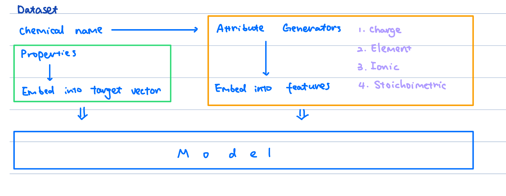

# Chem_ML: Machine Learning for Chemistry

[](https://www.python.org/)
[](https://jupyter.org/)
[](https://pytorch.org/)
[](https://scikit-learn.org/)
[](https://opensource.org/licenses/MIT)

This repository is a collection of machine learning algorithms and tools for chemistry. It is inspired by “A general-purpose machine learning framework for predicting” by Ward et al. [1]. The goal of this project is to provide a general-purpose machine learning framework for predicting materials properties.

## Introduction
It is often hard to embed the chemical structure of a molecule into a machine learning model. Inspired by the work of Ward et al. [1], I use the stiochiometric attributes, elemental attrubutes, electronic structures attributes and ionic attributes to describe the molecule and embed them into a machine learning model. The model is trained on the Quantum Machine Database (QMDB) and is able to predict the properties of a inorganic molecule.

Below is a schematic of the model:


> 1. Stoichiometric attributes that depend only on the fractions of elements present and not what those elements actually are. These include the number of elements present in the compound and several Lp norms of the fractions.  
> 2. Elemental property statistics, which are defined as the mean, mean absolute deviation, range, minimum, maximum and mode of 22 different elemental properties. This category includes attributes such as the maximum row on periodic table, average atomic number and the range of atomic radii between all elements present in the material.  
> 3. Electronic structure attributes, which are the average fraction of electrons from the s, p, d and f valence shells between all present elements. These are identical to the attributes used by Meredig et al.
> 4. Ionic compound attributes that include whether it is possible to form an ionic compound assuming all elements are present in a single oxidation state, and two adaptations of the fractional ‘ionic character’ of a compound based on an electronegativitybased measure.

<p align="right">Ward et al. [1]</p>

## Datasets
The datasets used in this project are from the Quantum Machine Database (QMDB). The QMDB is a collection of quantum mechanical data for molecules and materials. The `data/datasets/small-data.txt` is a small dataset used for testing the model. The full dataset is not included in this repository due to its size. The full dataset can be downloaded from the [QMDB website](http://quantum-machine.org/datasets/).

## Code Structure

The code is organized as follows:

- `data/`: Contains the data used in the project.
  - `data/datasets/`: Contains the datasets used in the project.
  - `data/properties/`: General chemistry properties.
  - `data/utils/`: Utility functions accessing chemical properties
- `generators/`: Generates attributes for chemicals based on their chemical structure.
- `models/`: Contains the machine learning models used in the project.
  - `models/trained_model.pth`: Pre-trained model.
- `tmp/`: Temporary files.
- `QMDB/`: Contains the Quantum Machine Database and related tools.
- `Chem_ML.ipynb`: Main notebook for the project.

## Installation
```bash
git clone https://github.com/eric-xin/Chem_ML.git
cd Chem_ML
pip install -r requirements.txt
```

## License
This project is licensed under the MIT License - see the [LICENSE](LICENSE) file for details.

## Contact
If you have any questions, feel free to contact me at [me@ericxin.eu](mailto:me@ericxin.eu)

## Citations
[1] L. Ward, “A general-purpose machine learning framework for predicting,” npj Computational Materials, 2016, doi: 10.1038/npjcompumats.2016.28.

## Acknowledgement
Some of the codes of this repo is from the [Magpie_python](https://github.com/ramv2/magpie_python). Their code is originally wrote in Python 2 and some of the functions are deprecated. I have updated the code to Python 3 and fixed some of the deprecated functions.