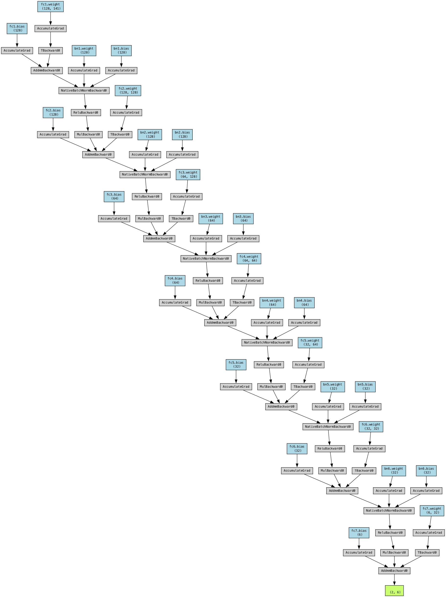

# Chem_ML: Machine Learning for Chemistry

[](https://www.python.org/)
[](https://jupyter.org/)
[](https://pytorch.org/)
[](https://scikit-learn.org/)
[](https://opensource.org/licenses/MIT)

This repository contains machine learning algorithms and tools for chemistry. It is inspired by “A general-purpose machine learning framework for predicting” by Ward et al. [1]. The goal of this project is to provide a general-purpose machine learning framework for predicting materials properties.

## Introduction
It is often hard to embed the chemical structure of a molecule into a machine learning model. Inspired by the work of Ward et al. [1], I use the stiochiometric attributes, elemental attrubutes, electronic structures attributes and ionic attributes to describe the molecule and embed them into a machine learning model. The model is trained on [The Open Quantum Materials Database](https://oqmd.org/) (OQMD, or QMDB) and is able to predict the properties of a inorganic molecule.

Basically, the model takes the chemical formula of a molecule as input and outputs the properties of the molecule. The properties of the molecule are the band gap, formation energy, and the stability of the molecule. Before training the model, the chemical formula is converted into a set of attributes that describe the molecule. The attributes are then fed into the machine learning model to train the model.

**Below is a schematic of the model:**


> 1. Stoichiometric attributes that depend only on the fractions of elements present and not what those elements actually are. These include the number of elements present in the compound and several Lp norms of the fractions.  
> 2. Elemental property statistics, which are defined as the mean, mean absolute deviation, range, minimum, maximum and mode of 22 different elemental properties. This category includes attributes such as the maximum row on periodic table, average atomic number and the range of atomic radii between all elements present in the material.  
> 3. Electronic structure attributes, which are the average fraction of electrons from the s, p, d and f valence shells between all present elements. These are identical to the attributes used by Meredig et al.
> 4. Ionic compound attributes that include whether it is possible to form an ionic compound assuming all elements are present in a single oxidation state, and two adaptations of the fractional ‘ionic character’ of a compound based on an electronegativitybased measure.

<p align="right">--- Ward et al. [1]</p>

## Datasets
The datasets used in this project are from The Open Quantum Materials Database (OQMD or QMDB). The QMDB is a collection of quantum mechanical data for molecules and materials. The `data/datasets/small-data.txt` is a small dataset used for testing the model. The full dataset is not included in this repository due to its size. The full dataset can be downloaded from the [OQMD website](https://oqmd.org/download/).

## Code Structure

The code is organized as follows:

<!-- - `data/`: Contains the data used in the project.
  - `data/datasets/`: Contains the datasets used in the project.
  - `data/properties/`: General chemistry properties.
  - `data/utils/`: Utility functions accessing chemical properties
- `generators/`: Generates attributes for chemicals based on their chemical structure.
- `models/`: Contains the machine learning models used in the project.
  - `models/trained_model.pth`: Pre-trained model.
- `tmp/`: Temporary files.
- `QMDB/`: Contains The Open Quantum Materials Database and related tools.
- `Chem_ML.ipynb`: Main notebook for the project. -->

```
.
├── Chem_ML.ipynb # Main notebook for the project
├── LICENSE # MIT License
├── QMDB # Contains The Open Quantum Materials Database and related tools
├── assets
│   └── img # Images used for the readme
├── data
│   ├── datasets # Contains the datasets(small) used in the project
│   ├── properties # General chemistry properties
│   └── utils # Includes utility functions accessing chemical properties
├── generator # Generates attributes for chemicals based on their chemical structure
├── model # Contains the machine learning models and related training and inference tools
│   └── utils # Utility functions for training and inference
├── readme.md # Readme file
├── requirements.txt # Required packages
└── tmp # Temporary files used for training
```

## Installation
```bash
git clone https://github.com/eric-xin/Chem_ML.git
cd Chem_ML
pip install -r requirements.txt
```

## Running the Code

### Jupyter Notebook
You can run the code by opening the `Chem_ML.ipynb` notebook in Jupyter Notebook.

```bash
jupyter notebook Chem_ML.ipynb
```

### Command Line Interface
Or you can run the code in the terminal by the newly implemented command line interface.

```bash
python model/utils/inference.py --entry "Y2I6" --model "./model/trained_model.pth"
python model/utils/train.py --model_import_path model.simple_model_residue.Net --learning_rate 0.001 --num_epochs 1000 --model_path model/ --save_temp --temp_path tmp/
```

**Command line arguments:**
- model/utils/train.py
```
usage: train.py [-h] [--model_import_path MODEL_IMPORT_PATH] [--learning_rate LEARNING_RATE]
                [--num_epochs NUM_EPOCHS] [--model_path MODEL_PATH] [--save_temp] [--temp_path TEMP_PATH]

Train the ChemML network model.

optional arguments:
  -h, --help            show this help message and exit
  --model_import_path MODEL_IMPORT_PATH
                        Path to the model class
  --learning_rate LEARNING_RATE
                        Learning rate for the optimizer
  --num_epochs NUM_EPOCHS
                        Number of epochs to train the model
  --model_path MODEL_PATH
                        Path to save the trained model
  --save_temp           Flag to save temporary files
  --temp_path TEMP_PATH
                        Path to save temporary files if save_temp is set
```

- model/utils/inference.py
```
usage: inference.py [-h] [--entry ENTRY] [--model MODEL] [--network NETWORK]

ChemML model inference

optional arguments:
  -h, --help         show this help message and exit
  --entry ENTRY      Entry Chemical Formula
  --model MODEL      Model Path
  --network NETWORK  Path to the model class
```

## Model Structure
*This is the structure of the currently used residue model*



## License
This project is licensed under the MIT License - see the [LICENSE](LICENSE) file for details.

## To-Do
- [ ] Implement the model on Google Colab to use more memory.
- [ ] Add the Ionic Compound Attributes to the training features. *
- [ ] Increase the amount of data used in training.

\* Note: The Ionic Compound Attributes are implemented in the code but are not used in the training features, because the ionization energy data is missing for some elements at certain oxidation states. This causes the model to crash when training (NaN values). Currently thinking of using the average ionization energy of the elements to fill in the missing values.

## Contact
If you have any questions, feel free to contact me at [me@ericxin.eu](mailto:me@ericxin.eu)

## Citations
[1] L. Ward, “A general-purpose machine learning framework for predicting,” npj Computational Materials, 2016, doi: 10.1038/npjcompumats.2016.28.

## Acknowledgement
Some of the codes of this repo is from the [Magpie_python](https://github.com/ramv2/magpie_python). Their code is originally wrote in Python 2 and some of the functions are deprecated. I have updated the code to Python 3 and fixed some of the deprecated functions.